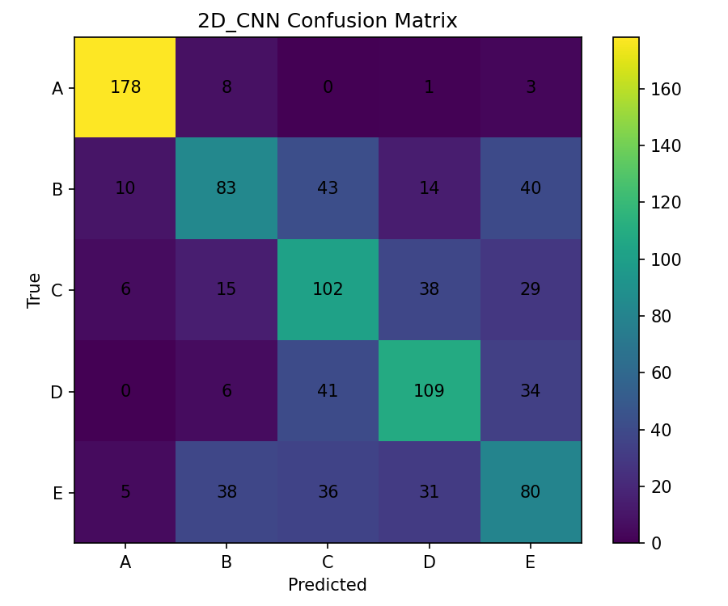
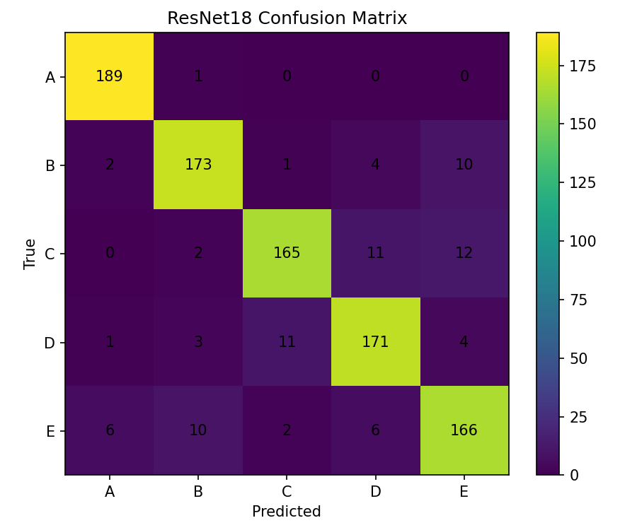
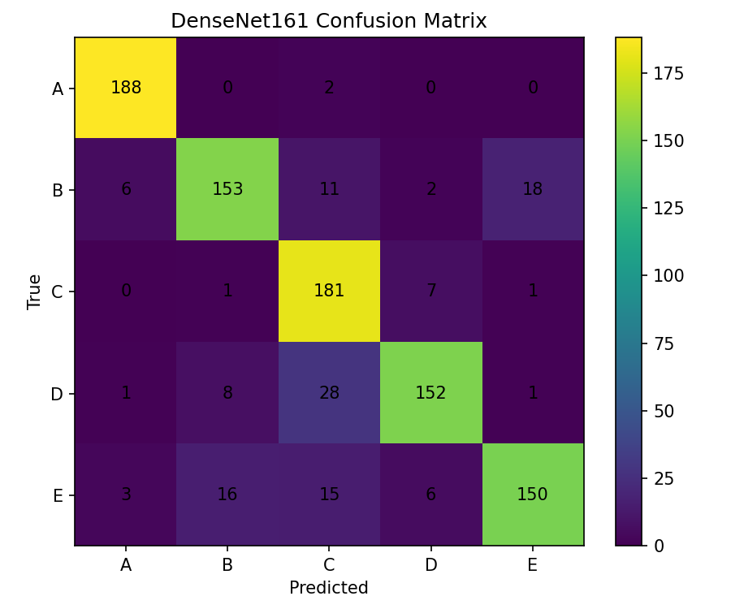

# Palm sEMG User Identification with CWT and Deep CNNs

손바닥 sEMG(surface Electromyography) 신호를 이용하여 5명의 사용자를 식별하는 딥러닝 분류 프로젝트입니다.  
2채널 sEMG 신호를 전처리한 뒤 CWT(Continuous Wavelet Transform)를 적용해 시간-주파수 특징으로 변환하고, **2D CNN, ResNet18, DenseNet161** 세 모델의 성능을 비교했습니다.

---

## 1. 코드 설명

### 1.1 데이터

사용 데이터는 A~E 총 5개 클래스의 sEMG 신호로 구성되어 있습니다.

- 클래스: A, B, C, D, E
- 클래스별 시행 수: 50개
- 전체 시행 수: 250개
- 각 CSV 크기: 약 3,000 samples × 2 channels
- Sampling Frequency: 1,000 Hz

데이터 출처:

- https://github.com/sea3551/palm-sEMG-doorknob-filtered

### 1.2 데이터 전처리

다음 순서로 sEMG 신호를 전처리했습니다.

1. **60 Hz Notch Filter**를 적용하여 전원선 잡음을 제거했습니다.
2. **20~499 Hz Band-pass Filter**를 적용했습니다.
3. 신호를 **300 ms window / 150 ms hop**으로 분할했습니다.
   - 하나의 3초 시행에서 19개의 window가 생성됩니다.
4. 각 window에 **Min-Max Normalization**을 적용했습니다.
5. **CWT(Continuous Wavelet Transform)**를 적용했습니다.
   - Wavelet: Morlet (`morl`)
   - Scale: 1~32
   - 두 sEMG 채널과 두 채널의 평균 map을 이용하여 최종 입력 크기를 `(3, 32, 300)`으로 구성했습니다.

데이터 누수를 방지하기 위해 window를 생성하기 전에 **CSV 시행 단위로 Train/Validation/Test를 분리**했습니다.

- Train: 160 trials → 3,040 windows
- Validation: 40 trials → 760 windows
- Test: 50 trials → 950 windows

### 1.3 사용 모델

세 모델을 동일한 데이터 분할과 학습 조건에서 비교했습니다.

- 2D CNN
- ResNet18
- DenseNet161

ResNet18과 DenseNet161은 사전학습 가중치를 사용하지 않고 학습했습니다.

### 1.4 학습 조건

| 항목 | 설정 |
| --- | --- |
| Optimizer | AdamW |
| Learning Rate | 0.001 |
| Weight Decay | 0.0001 |
| Batch Size | 16 |
| Epochs | 80 |
| Loss | Cross Entropy Loss |
| Scheduler | ReduceLROnPlateau |
| Random Seed | 42 |
| Model Selection | Validation Accuracy가 가장 높은 epoch |
| Device | CUDA GPU |

### 1.5 실행 방법

Google Colab에서 아래 노트북을 위에서부터 순서대로 실행합니다.

```text
notebooks/semg_model_comparison.ipynb
```

노트북 실행 과정에서 데이터 다운로드, 전처리, 모델 학습, 테스트 평가, Confusion Matrix 생성까지 수행합니다.

### 1.6 코드 파일 설명

| 파일/폴더 | 설명 |
| --- | --- |
| `notebooks/semg_model_comparison.ipynb` | 데이터 전처리, 모델 학습, 성능 평가 전체 코드 |
| `results/` | 모델 성능 비교표 및 Confusion Matrix |
| `README.md` | 프로젝트 설명 및 실험 결과 |
| `.gitignore` | 데이터, 모델 가중치, 임시 파일 제외 설정 |

---

## 2. 모델 성능 비교

동일한 Train/Validation/Test 분할과 학습 조건을 적용하여 세 모델의 성능을 비교했습니다.

| Model | Accuracy | Precision | Recall | F1-score |
| --- | ---: | ---: | ---: | ---: |
| 2D CNN | **58.11%** | **[추가 계산 필요]** | **58.11%** | **57.87%** |
| ResNet18 | **90.95%** | **[추가 계산 필요]** | **90.95%** | **90.92%** |
| DenseNet161 | **86.74%** | **87.31%** | **86.74%** | **86.66%** |

> Test set은 각 클래스가 190개씩 동일하게 구성되어 있어 Macro Recall과 전체 Accuracy가 동일하게 계산됩니다.

### 성능 분석

이번 실험에서는 **ResNet18이 Accuracy 90.95%, Macro F1-score 90.92%로 가장 높은 성능**을 나타냈습니다.  
DenseNet161은 Accuracy 86.74%, Macro F1-score 86.66%로 두 번째로 높은 성능을 보였으며, 단순 2D CNN은 Accuracy 58.11%, Macro F1-score 57.87%로 상대적으로 낮은 성능을 보였습니다.

ResNet18은 residual connection을 사용하여 비교적 깊은 네트워크를 안정적으로 학습하면서도 DenseNet161보다 모델 복잡도가 낮아, 본 실험의 제한된 sEMG 데이터에서 상대적으로 효율적인 특징 학습이 이루어진 것으로 추정됩니다. 반면 DenseNet161은 더 많은 파라미터와 긴 학습 시간이 필요했지만 본 실험에서는 더 높은 테스트 성능으로 이어지지 않았습니다.

### 추가적인 계산 비용 비교

| Model | Parameters | Training Time | Inference Time |
| --- | ---: | ---: | ---: |
| 2D CNN | 19,717 | 435.66 s | 0.413 ms/sample |
| ResNet18 | 11,179,077 | 440.79 s | 2.301 ms/sample |
| DenseNet161 | 26,483,045 | 1,910.06 s | 21.209 ms/sample |

성능과 계산 비용을 함께 고려하면, 이번 실험에서는 ResNet18이 높은 분류 성능과 DenseNet161보다 낮은 계산 비용을 동시에 보였습니다.

---

## 3. Confusion Matrix 분석

### 3.1 2D CNN



- 가장 잘 분류된 클래스: **[Confusion Matrix 생성 후 입력]**
- 가장 많이 오분류된 클래스: **[Confusion Matrix 생성 후 입력]**
- 주요 오분류 유형: **[Confusion Matrix 생성 후 입력]**
- 오분류가 발생한 이유에 대한 분석: 단순 2D CNN은 ResNet18과 DenseNet161에 비해 특징 추출 구조가 얕고 표현 능력이 제한적이기 때문에, 서로 유사한 sEMG 시간-주파수 패턴을 충분히 분리하지 못했을 가능성이 있습니다.

### 3.2 ResNet18



- 가장 잘 분류된 클래스: **[Confusion Matrix 생성 후 입력]**
- 가장 많이 오분류된 클래스: **[Confusion Matrix 생성 후 입력]**
- 주요 오분류 유형: **[Confusion Matrix 생성 후 입력]**
- 오분류가 발생한 이유에 대한 분석: ResNet18은 전체적으로 높은 분류 성능을 보였으나, 사용자 간 sEMG 활성 패턴이 유사한 구간에서는 일부 오분류가 발생할 수 있습니다. 정확한 주요 오류 유형은 해당 모델의 Confusion Matrix를 기준으로 판단합니다.

### 3.3 DenseNet161



동일 실험에서 얻은 DenseNet161 Confusion Matrix는 다음과 같습니다.

```text
[[188,  0,  2,  0,  0],
 [  6,153, 11,  2, 18],
 [  0,  1,181,  7,  1],
 [  1,  8, 28,152,  1],
 [  3, 16, 15,  6,150]]
```

- 가장 잘 분류된 클래스: **A**
  - 190개 중 188개를 올바르게 분류했습니다.
- 가장 많이 오분류된 클래스: **E**
  - 190개 중 150개를 올바르게 분류해 다섯 클래스 중 Recall이 가장 낮았습니다.
- 주요 오분류 유형: **D → C**
  - 총 **28회** 발생했습니다.
- 오분류가 발생한 이유에 대한 분석:
  - C와 D 사용자의 일부 sEMG 신호가 CWT 시간-주파수 표현에서 유사하게 나타났을 가능성이 있습니다.
  - 또한 sEMG는 전극 접촉 상태, 근수축 강도, 손의 미세한 자세 차이 등에 따라 변동될 수 있으므로 클래스 간 특징이 일부 겹쳤을 가능성이 있습니다.
  - 본 실험만으로 정확한 생리학적 원인을 확정할 수는 없으며, 추가 데이터와 반복 실험이 필요합니다.

---

## 4. 최종 결과

- **가장 성능이 좋은 모델:** ResNet18
  - Test Accuracy: **90.95%**
  - Macro F1-score: **90.92%**

- **가장 성능이 낮은 모델:** 2D CNN
  - Test Accuracy: **58.11%**
  - Macro F1-score: **57.87%**

- **DenseNet161의 주요 오분류:** D → C, 28회

- **전체적인 실험 결과 및 느낀 점:**
  - 동일한 sEMG 데이터와 학습 조건에서도 모델 구조에 따라 성능 차이가 크게 나타났습니다.
  - 단순 2D CNN보다 ResNet18과 DenseNet161 같은 깊은 CNN 구조가 CWT 기반 시간-주파수 특징을 분류하는 데 더 효과적이었습니다.
  - 그러나 더 큰 모델이 항상 더 좋은 결과를 보이는 것은 아니었습니다. DenseNet161은 ResNet18보다 파라미터 수와 학습 시간이 크게 증가했지만 이번 실험에서는 ResNet18보다 낮은 테스트 성능을 기록했습니다.
  - 따라서 실제 모델을 선택할 때는 정확도뿐만 아니라 모델 크기, 학습 시간, 추론 속도도 함께 고려할 필요가 있음을 확인했습니다.

### 추가 검증: DenseNet161 5-Fold Cross Validation

CSV 시행 단위로 Stratified 5-Fold Cross Validation을 수행했습니다.

| Fold | Accuracy |
| --- | ---: |
| Fold 1 | 89.58% |
| Fold 2 | 89.26% |
| Fold 3 | 91.58% |
| Fold 4 | 92.95% |
| Fold 5 | 92.00% |

- Mean Accuracy: **91.07 ± 1.42%**
- Mean Macro F1: **91.03 ± 1.44%**

단일 Train/Test split뿐만 아니라 5-Fold Cross Validation에서도 약 91% 수준의 평균 성능을 확인했습니다.

---

## Repository Structure

```text
semg-palm-identification/
├── README.md
├── LICENSE
├── .gitignore
├── notebooks/
│   └── semg_model_comparison.ipynb
└── results/
    ├── model_comparison.csv
    ├── 5fold_results.csv
    ├── 5fold_summary.csv
    ├── confusion_2D_CNN.png
    ├── confusion_ResNet18.png
    ├── confusion_DenseNet161.png
    ├── filter_check.png
    └── signal_example.png
```

## Notes

학습 데이터(`data/`)와 PyTorch 모델 가중치(`*.pth`, `*.pt`)는 파일 크기 및 저장소 관리 문제로 Repository에 포함하지 않습니다.  
데이터는 공개 Repository에서 내려받을 수 있으며, 노트북 실행 시 동일한 전처리 및 학습 절차를 재현할 수 있습니다.
